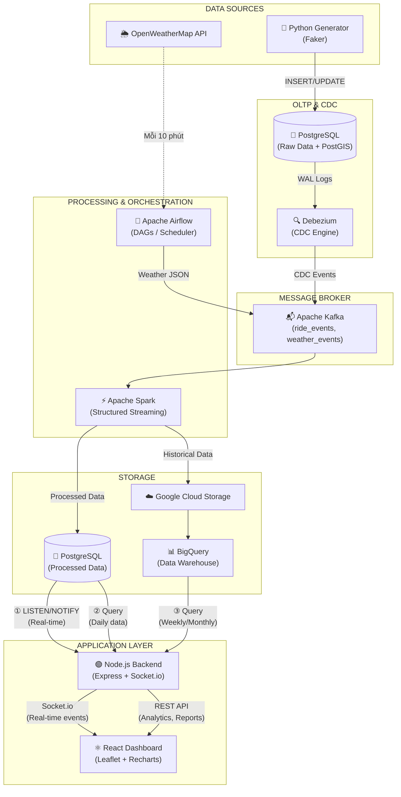
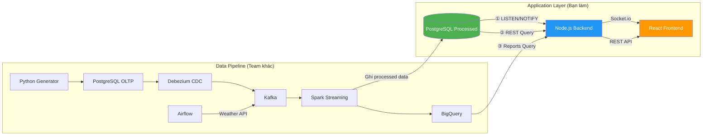

# RideStream Backend — Kế hoạch triển khai & Kiến trúc

> Tài liệu này tóm tắt kiến trúc Backend + Frontend và danh sách công việc chi tiết cho tầng Application Layer của RideStream.

---

## 1. Tổng quan kiến trúc

### 1.1 Sơ đồ toàn bộ hệ thống



### 1.2 Ba điểm kết nối Backend ↔ Data Pipeline

Backend Node.js kết nối vào data pipeline ở **3 điểm**:



| # | Nguồn | Cơ chế | Dùng cho | Tốc độ |
|---|---|---|---|---|
| ① | PostgreSQL (OLTP + Processed) | `LISTEN/NOTIFY` → Socket.io | Real-time: cuốc xe mới, thay đổi trạng thái, surge alerts, KPI updates | < 1 giây |
| ② | PostgreSQL (OLTP + Processed) | REST API query (`Prisma`) | Danh sách cuốc xe, chi tiết, analytics trong ngày | ~50-200ms |
| ③ | BigQuery | REST API query (`@google-cloud/bigquery`) | Báo cáo tuần/tháng/quý, xu hướng | 1-5s |

---

## 2. Luồng dữ liệu Real-time (Chi tiết)

Hệ thống sử dụng **PostgreSQL LISTEN/NOTIFY** trên 2 nhóm bảng:
- **Bảng OLTP** (`rides`): Trigger khi có cuốc xe mới hoặc thay đổi trạng thái — dữ liệu gốc từ Python Generator.
- **Bảng Processed** (`live_district_metrics`, `live_system_kpis`): Trigger khi Spark ghi kết quả xử lý — dữ liệu đã tổng hợp.

Backend nhận sự kiện và đẩy xuống Frontend qua **Socket.io**.

```
Luồng 1 — OLTP:
  Python Generator ──→ INSERT/UPDATE vào bảng rides
                                    ↓
                        Database Trigger kích hoạt
                                    ↓
                        pg_notify('new_ride' | 'ride_status_changed', payload)
                                    ↓
                    Node.js pg client (LISTEN) nhận event
                                    ↓
                    Socket.io emit → React cập nhật UI

Luồng 2 — Processed:
  Spark xử lý xong ──→ INSERT/UPDATE vào live_district_metrics / live_system_kpis
                                    ↓
                        Database Trigger kích hoạt
                                    ↓
                        pg_notify('surge_alert' | 'kpi_update', payload)
                                    ↓
                    Node.js pg client (LISTEN) nhận event
                                    ↓
                    Socket.io emit → React cập nhật UI
```

### 2.1 PostgreSQL Triggers & NOTIFY Channels

| Bảng PostgreSQL | Loại | NOTIFY Channel | Backend Event | Mô tả | Trigger khi |
| :--- | :--- | :--- | :--- | :--- | :--- |
| `rides` | OLTP | `new_ride` | `ride:new` | Cuốc xe mới được tạo | INSERT |
| `rides` | OLTP | `ride_status_changed` | `ride:status_changed` | Cuốc xe thay đổi trạng thái | UPDATE trên cột `status` |
| `live_district_metrics` | Processed | `surge_alert` | `alert:surge` | Cập nhật hệ số surge theo quận | INSERT / UPDATE |
| `live_system_kpis` | Processed | `kpi_update` | `kpi:update` | Cập nhật KPI toàn hệ thống | INSERT / UPDATE |

**Ví dụ trigger SQL:**

```sql
-- Trigger 1: Khi có cuốc xe mới (bảng OLTP rides)
CREATE OR REPLACE FUNCTION notify_new_ride()
RETURNS TRIGGER AS $$
BEGIN
  PERFORM pg_notify('new_ride', row_to_json(NEW)::text);
  RETURN NEW;
END;
$$ LANGUAGE plpgsql;

CREATE TRIGGER ride_inserted
AFTER INSERT ON rides
FOR EACH ROW EXECUTE FUNCTION notify_new_ride();

-- Trigger 2: Khi trạng thái cuốc xe thay đổi (bảng OLTP rides)
CREATE OR REPLACE FUNCTION notify_ride_status_changed()
RETURNS TRIGGER AS $$
BEGIN
  IF OLD.status IS DISTINCT FROM NEW.status THEN
    PERFORM pg_notify('ride_status_changed', row_to_json(NEW)::text);
  END IF;
  RETURN NEW;
END;
$$ LANGUAGE plpgsql;

CREATE TRIGGER ride_status_updated
AFTER UPDATE ON rides
FOR EACH ROW EXECUTE FUNCTION notify_ride_status_changed();

-- Trigger 3: Khi Spark cập nhật surge metrics (bảng Processed)
CREATE OR REPLACE FUNCTION notify_surge_alert()
RETURNS TRIGGER AS $$
BEGIN
  PERFORM pg_notify('surge_alert', row_to_json(NEW)::text);
  RETURN NEW;
END;
$$ LANGUAGE plpgsql;

CREATE TRIGGER district_metrics_changed
AFTER INSERT OR UPDATE ON live_district_metrics
FOR EACH ROW EXECUTE FUNCTION notify_surge_alert();

-- Trigger 4: Khi Spark cập nhật KPI toàn hệ thống (bảng Processed)
CREATE OR REPLACE FUNCTION notify_kpi_update()
RETURNS TRIGGER AS $$
BEGIN
  PERFORM pg_notify('kpi_update', row_to_json(NEW)::text);
  RETURN NEW;
END;
$$ LANGUAGE plpgsql;

CREATE TRIGGER system_kpis_changed
AFTER INSERT OR UPDATE ON live_system_kpis
FOR EACH ROW EXECUTE FUNCTION notify_kpi_update();
```

### 2.2 Socket.io Events

| Event | Hướng | NOTIFY Channel nguồn | Bảng nguồn | Mô tả |
| :--- | :--- | :--- | :--- | :--- |
| `ride:new` | Server → Client | `new_ride` | `rides` | Cuốc xe mới được tạo |
| `ride:status_changed` | Server → Client | `ride_status_changed` | `rides` | Trạng thái cuốc xe thay đổi |
| `alert:surge` | Server → Client | `surge_alert` | `live_district_metrics` | Cập nhật hệ số surge theo quận |
| `kpi:update` | Server → Client | `kpi_update` | `live_system_kpis` | Cập nhật KPI toàn hệ thống |

> **Lưu ý:** Phát hiện gian lận (fraud detection) không có bảng processed riêng trong database hiện tại. Dữ liệu fraud được truy vấn qua REST API bằng cách phân tích bảng `rides` (GPS spoofing, route deviation, promo abuse) — xem Business Requirement #4 trong [DESIGN.md](./DESIGN.md).

---

## 3. REST API Endpoints (Dự kiến)

API đọc dữ liệu từ 2 nguồn: **PostgreSQL** (dữ liệu real-time và trong ngày) và **BigQuery** (thống kê lịch sử theo tuần/tháng/quý).

### 3.1 Authentication

| Method | Endpoint | Mô tả |
| :--- | :--- | :--- |
| `POST` | `/api/auth/login` | Đăng nhập (JWT) |
| `POST` | `/api/auth/register` | Đăng ký tài khoản admin |

### 3.2 Rides (PostgreSQL — `rides`)

| Method | Endpoint | Mô tả |
| :--- | :--- | :--- |
| `GET` | `/api/rides` | Danh sách cuốc xe (phân trang, filter theo quận/trạng thái/khung giờ) |
| `GET` | `/api/rides/:id` | Chi tiết cuốc xe |

### 3.3 Analytics (PostgreSQL — aggregate queries trên `rides` + `live_*`)

| Method | Endpoint | Nguồn dữ liệu | Mô tả |
| :--- | :--- | :--- | :--- |
| `GET` | `/api/analytics/overview` | `live_system_kpis` + aggregate `rides` | Tổng quan KPI (tổng cuốc, doanh thu, tỷ lệ hủy, tài xế online) |
| `GET` | `/api/analytics/by-district` | `live_district_metrics` | Thống kê theo quận (demand, supply, surge) |
| `GET` | `/api/analytics/by-weather` | `live_district_metrics` + aggregate `rides` | Phân tích tác động thời tiết lên nhu cầu |
| `GET` | `/api/analytics/congestion` | Aggregate `rides` (PostGIS) | Chỉ số kẹt xe theo khu vực |

### 3.4 Alerts & Fraud (PostgreSQL)

| Method | Endpoint | Nguồn dữ liệu | Mô tả |
| :--- | :--- | :--- | :--- |
| `GET` | `/api/alerts/surge` | `live_district_metrics` (filter `surge_multiplier > 1.0`) | Danh sách quận đang có surge pricing |
| `GET` | `/api/alerts/fraud` | Derived query trên `rides` | Danh sách cuốc xe bất thường (GPS spoofing, quãng đường < 100m, vận tốc > 150km/h) |

### 3.5 Reports (BigQuery — thống kê lịch sử)

| Method | Endpoint | Mô tả |
| :--- | :--- | :--- |
| `GET` | `/api/reports/weekly` | Báo cáo tổng hợp theo tuần (doanh thu, số cuốc, tỷ lệ hủy) |
| `GET` | `/api/reports/monthly` | Báo cáo tổng hợp theo tháng |
| `GET` | `/api/reports/trends` | Biểu đồ xu hướng doanh thu / nhu cầu theo thời gian |
| `GET` | `/api/reports/weather-impact` | Phân tích tác động thời tiết lên doanh thu theo tháng |

---

## 4. Tech Stack

### 4.1 Backend

| Thành phần | Công nghệ | Ghi chú |
| :--- | :--- | :--- |
| **Runtime** | Node.js | |
| **Framework** | Express hoặc Fastify | |
| **Authentication** | JWT (`jsonwebtoken`, `bcrypt`) | |
| **Database (LISTEN/NOTIFY)** | `pg` (PostgreSQL client) | Dùng cho real-time events |
| **Database (REST API)** | Prisma (ORM) | Dùng cho queries & mutations |
| **Data Warehouse** | `@google-cloud/bigquery` | Thống kê tuần/tháng/quý |
| **Real-time** | `Socket.io` | WebSocket server |
| **Validation** | `Zod` hoặc `Joi` | Schema validation cho request body |
| **Container** | Docker | |

### 4.2 Frontend

| Thành phần | Công nghệ | Ghi chú |
| :--- | :--- | :--- |
| **Framework** | React (Vite) | |
| **Bản đồ** | Leaflet / React-Leaflet | Heatmap, markers |
| **Biểu đồ** | Recharts hoặc Chart.js | |
| **Real-time Client** | `socket.io-client` | |
| **HTTP Client** | Axios | |
| **State Management** | React Context hoặc Zustand | |
| **Styling** | CSS Modules hoặc Styled Components | |

---

## 5. Frontend Dashboard — Các trang chính

| Trang | Mô tả | Nguồn dữ liệu |
| :--- | :--- | :--- |
| **Login** | Đăng nhập admin | REST API (Auth) |
| **Overview Dashboard** | Tổng quan KPI + bản đồ nhiệt + live feed cuốc xe | Socket.io (`ride:new`, `kpi:update`) + REST API (`/analytics/overview`) |
| **Surge Alerts** | Bảng cảnh báo tăng giá theo quận, thời gian thực | Socket.io (`alert:surge`) + REST API (`/alerts/surge`, `/analytics/by-district`) |
| **Fraud Detection** | Danh sách cuốc xe bị gắn cờ bất thường | REST API only (`/alerts/fraud`) — không có real-time event |
| **Analytics** | Biểu đồ phân tích theo quận, thời tiết, khung giờ | REST API (`/analytics/*`) |
| **Reports** | Xuất báo cáo, so sánh giai đoạn | REST API (BigQuery — `/reports/*`) |

---

## 6. Kế hoạch triển khai (Phased Implementation)

### Phase 1: Setup & Auth
- [ ] Khởi tạo project Node.js (Express hoặc Fastify)
- [ ] Cấu hình Docker container cho backend
- [ ] Kết nối PostgreSQL (bảng processed) bằng Prisma
- [ ] Xây dựng Authentication: `POST /api/auth/login`, `/register` (JWT + bcrypt)
- [ ] Middleware: auth guard, error handler, request validation (Zod)

### Phase 2: REST API (PostgreSQL)
- [ ] `GET /api/rides` — Danh sách cuốc xe (phân trang, filter quận/trạng thái/khung giờ)
- [ ] `GET /api/rides/:id` — Chi tiết cuốc xe
- [ ] `GET /api/analytics/overview` — KPI tổng quan (tổng cuốc, doanh thu, tỷ lệ hủy)
- [ ] `GET /api/analytics/by-district` — Thống kê theo quận
- [ ] `GET /api/analytics/by-weather` — Tác động thời tiết
- [ ] `GET /api/analytics/congestion` — Chỉ số kẹt xe
- [ ] `GET /api/alerts/surge` — Danh sách cảnh báo surge
- [ ] `GET /api/alerts/fraud` — Danh sách cảnh báo fraud

### Phase 3: Real-time (LISTEN/NOTIFY + Socket.io)
- [ ] Tạo PostgreSQL triggers trên bảng OLTP (`rides`) cho channel `new_ride` và `ride_status_changed`
- [ ] Tạo PostgreSQL triggers trên bảng Processed (`live_district_metrics`) cho channel `surge_alert`
- [ ] Tạo PostgreSQL triggers trên bảng Processed (`live_system_kpis`) cho channel `kpi_update`
- [ ] Setup `pg` client với LISTEN trên 4 channel: `new_ride`, `ride_status_changed`, `surge_alert`, `kpi_update`
- [ ] Setup Socket.io server
- [ ] Emit events: `ride:new`, `ride:status_changed`, `alert:surge`, `kpi:update`

### Phase 4: BigQuery Reports
- [ ] Kết nối `@google-cloud/bigquery`
- [ ] `GET /api/reports/weekly` — Báo cáo tuần
- [ ] `GET /api/reports/monthly` — Báo cáo tháng
- [ ] `GET /api/reports/trends` — Xu hướng doanh thu
- [ ] `GET /api/reports/weather-impact` — Tác động thời tiết lên doanh thu

### Phase 5: React Dashboard
- [ ] Khởi tạo React (Vite) + cấu hình routing
- [ ] Trang Login (JWT auth)
- [ ] Trang Overview Dashboard — KPI cards + bản đồ nhiệt (Leaflet) + live feed (Socket.io)
- [ ] Trang Surge Alerts — bảng cảnh báo real-time
- [ ] Trang Fraud Detection — danh sách cuốc xe bất thường
- [ ] Trang Analytics — biểu đồ Recharts (theo quận, thời tiết, khung giờ)
- [ ] Trang Reports — báo cáo tuần/tháng từ BigQuery

---

## 7. Mapping bảng Database ↔ Backend

Tóm tắt cách Backend sử dụng từng bảng trong PostgreSQL:

| Bảng | Loại | Backend sử dụng | Cơ chế |
| :--- | :--- | :--- | :--- |
| `rides` | OLTP | Live feed cuốc xe, chi tiết cuốc xe, fraud detection | LISTEN/NOTIFY + REST API (Prisma) |
| `rides_status_log` | OLTP | Phân tích thời gian chờ (ETA), lịch sử trạng thái | REST API (Prisma) |
| `users` | OLTP | Thông tin hành khách | REST API (Prisma) |
| `drivers` | OLTP | Thông tin tài xế, hiệu suất | REST API (Prisma) |
| `vehicles` | OLTP | Thông tin phương tiện | REST API (Prisma) |
| `payments` | OLTP | Thông tin thanh toán, doanh thu | REST API (Prisma) |
| `live_district_metrics` | Processed | Surge alerts, heatmap, thống kê theo quận | LISTEN/NOTIFY + REST API (Prisma) |
| `live_system_kpis` | Processed | Overview KPI (tổng cuốc, tài xế, thời gian chờ) | LISTEN/NOTIFY + REST API (Prisma) |
| `fact_rides` + `dim_*` | DWH (BigQuery) | Báo cáo tuần/tháng/quý, xu hướng | REST API (`@google-cloud/bigquery`) |

> **Lưu ý:** Sơ đồ pipeline hiện tại (`RideStream-db-Tools pipeline.drawio.png`) đã bao phủ Application Layer (Node.js + React) với 3 điểm kết nối.

---

*Tài liệu được tạo: 29/03/2026*
*Cập nhật lần cuối: 29/03/2026 — Đồng bộ với DATABASE-DESIGN.md và sơ đồ draw.io.*
