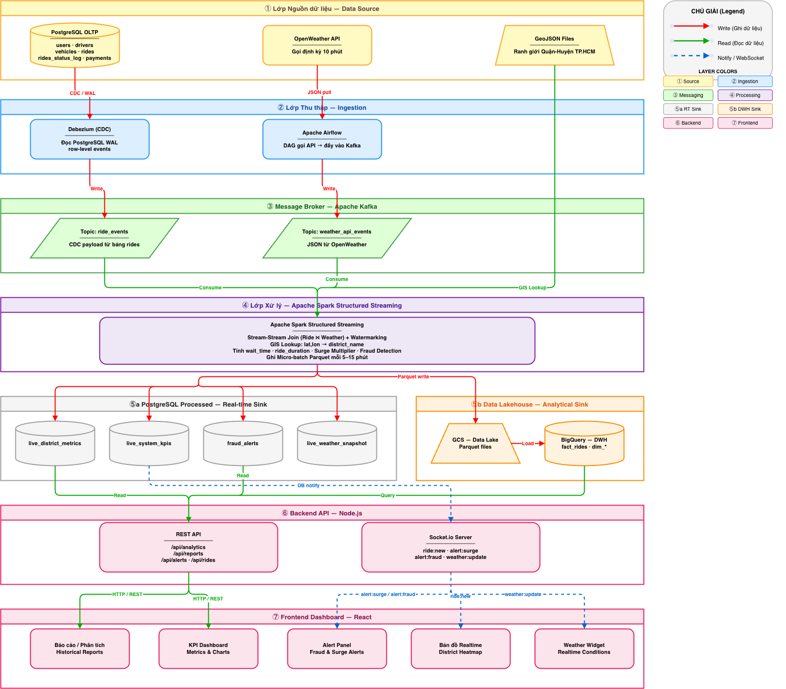
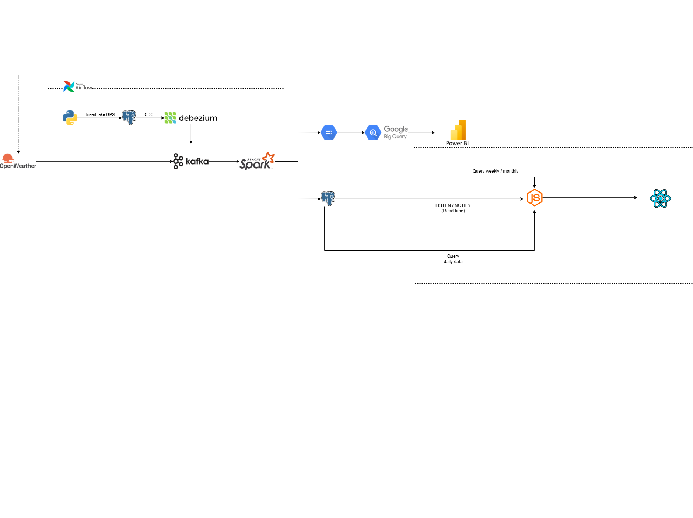

## A. Nguồn dữ liệu

Dữ liệu đầu vào của hệ thống được thiết kế để mô phỏng sự tương tác phức tạp giữa môi trường, thời gian và hành vi con người. 
### 1. Luồng sự kiện vận hành & Giao thông (Ride Events & Traffic Telemetry)

Đây là nguồn dữ liệu cốt lõi quan trọng nhất, được sinh ra từ hệ thống giả lập Backend bằng PostgreSQL. Hệ thống không chỉ lưu lại sự kiện giao dịch mà còn sinh ra dữ liệu Telemetry.

- **Bản chất:** Dữ liệu giao dịch (High-throughput Transactional) và Dữ liệu chuỗi thời gian liên tục (High-frequency Telemetry).
- **Cách thức tạo dữ liệu:** Một script Python Data Generator sử dụng thư viện `Faker`. Script liên tục thực hiện lệnh `INSERT/UPDATE` giả lập toàn bộ vòng đời cuốc xe.
- **Logic giả lập hành vi thực tế (Traffic Logic):** 
  - Vận tốc di chuyển của tài xế được lập trình biến thiên dựa trên Tọa độ địa lý và Khung giờ hệ thống. 
  - *Ví dụ:* Script sẽ tự động sinh vận tốc thấp (< 15km/h) cho các cuốc xe có tọa độ ở trọng tâm Quận 1 vào khung giờ 07:30 - 09:00, và sinh vận tốc cao (40-50km/h) cho vùng ngoại thành hoặc giờ thấp điểm.
- **Mục tiêu:** Giả lập trực tiếp dữ liệu GPS để stream processing engine như Spark tính toán Chỉ số kẹt xe (Real-time Congestion Index) và đo lường tham số trễ (Latency).

### 2. Dữ liệu bối cảnh môi trường (External Weather API)

Trong nghiệp vụ gọi xe, thời tiết tác động trực tiếp lên hệ số giá và nhu cầu gọi xe.

- **Bản chất:** Dữ liệu kéo định kỳ (Polling / Micro-batch Data).
- **Nguồn cung cấp:** API từ **OpenWeatherMap**.
- **Cách thức thu thập:** Apache Airflow kích hoạt vòng lặp (DAGs) tự động gọi API mỗi 10 phút, sau đó đẩy trực tiếp chuỗi JSON payload vào một topic Kafka (ví dụ: `weather_api_events`).
- **Vai trò:** Kết hợp chặt chẽ với dữ liệu giao thông thông qua **Stream-Stream Join (cùng Watermarking)** trên Spark để giải bài toán Định giá động (Dynamic Pricing). Mô hình kinh doanh thực tế diễn ra ngay tức thì khi: Mưa to nhận từ Kafka + Kẹt xe từ Telemetry -> Hệ số giá tăng mạnh.

### 3. Dữ liệu Không gian & Danh mục (Spatial & Metadata)

Để hệ thống chuyển biến dữ liệu "thô" (vĩ độ, kinh độ, timestamp) thành "ngữ cảnh" (quận nào, phân loại thời gian gì), chúng ta cần mô hình hóa dữ liệu chiều.

- **Bản chất:** Dữ liệu tĩnh.
- **Dữ liệu Không gian:** Các file định dạng **GeoJSON** chứa tọa độ đa giác vẽ ranh giới Quận/Huyện TP.HCM. Sử dụng qua các hàm phân tích không gian (GIS) trên SQL để khoanh vùng khu vực ùn tắc.
- **Danh mục Thời gian:** Một tệp metadata định nghĩa các khoảng thời gian đặc thù:
  - `Morning_Rush`: 07:00 - 09:00
  - `Evening_Rush`: 16:30 - 19:00
  - `Weekend_Peak`: Tối thứ 7 và Chủ nhật
- **Vai trò:** Cung cấp baseline để gán nhãn tự động (Automated Classification) cho các sự kiện trực tiếp trên luồng stream, mở đường cho phân tích xu hướng giá và nhu cầu.

## B. Dữ liệu được thu thập

Hệ thống xử lý hai luồng dữ liệu chính với định dạng JSON. Dưới đây là cấu trúc chi tiết của các gói tin (payloads) khi được nạp vào hệ thống:

### 1. Luồng dữ liệu Thời gian thực: Gói tin CDC Cuốc xe (Ride Event Payload)

Khi có sự thay đổi (INSERT/UPDATE) trong PostgreSQL, Debezium sẽ chụp lại dòng dữ liệu đó và đẩy vào Kafka dưới dạng một chuỗi JSON. Dưới đây là cấu trúc gói tin đại diện cho một cuốc xe ở trạng thái `completed` đã được trích xuất  để Spark Streaming xử lý:

```json
{
  "payload": {
    "ride_id": "RIDE-8f72a1b9",
    "user_id": "USR-10945",
    "driver_id": "DRV-5542",
    "service_type": "Car",
    "pickup_lat": 10.7769,
    "pickup_lon": 106.7009,
    "dropoff_lat": 10.7966,
    "dropoff_lon": 106.7128,
    "status": "completed",
    "estimated_fare_vnd": 45000.00,
    "created_at": "2026-03-13T08:00:00Z",
    "updated_at": "2026-03-13T08:25:12Z"
  }
}
```

**Data Dictionary:**

| Trường dữ liệu (Field)  | Kiểu dữ liệu (Type) | Mô tả chi tiết (Description)                                            |
| :---------------------- | :------------------ | :---------------------------------------------------------------------- |
| `ride_id`               | String (UUID)       | Mã định danh duy nhất của cuốc xe.                                      |
| `user_id` / `driver_id` | String              | Mã khách hàng và mã tài xế nhận cuốc.                                   |
| `service_type`          | String              | Phân loại dịch vụ (VD: RideBike, RideCar, RideDelivery).                |
| `pickup_lat` / `lon`    | Decimal             | Tọa độ điểm đón (Vĩ độ / Kinh độ).                                      |
| `status`                | String              | Trạng thái cuốc xe (`requested`, `accepted`, `completed`, `cancelled`). |
| `estimated_fare_vnd`    | Float               | Cước phí dự kiến tính bằng VNĐ.                                         |
| `updated_at`            | Timestamp           | Thời gian xảy ra sự kiện thay đổi trạng thái cuối cùng.                 |

### 2. Luồng dữ liệu Định kỳ: Gói tin API Thời tiết (Weather API Response)

Dữ liệu được Apache Airflow kéo về từ OpenWeatherMap API mỗi 10 phút. Gói tin trả về là dạng JSON lồng nhau, yêu cầu kỹ năng giải nén trong quá trình xử lý ETL.

```json
{
  "coord": {
    "lon": 106.6667,
    "lat": 10.75
  },
  "weather": [
    {
      "id": 501,
      "main": "Rain",
      "description": "moderate rain",
      "icon": "10d"
    }
  ],
  "main": {
    "temp": 28.5,
    "feels_like": 32.1,
    "temp_min": 27.0,
    "temp_max": 29.5,
    "pressure": 1010,
    "humidity": 85
  },
  "visibility": 8000,
  "wind": {
    "speed": 4.1,
    "deg": 250
  },
  "rain": {
    "1h": 3.2
  },
  "dt": 1710313200,
  "name": "Ho Chi Minh City",
  "cod": 200
}
```

**Từ điển dữ liệu (Data Dictionary - Các trường cần trích xuất):**

| Trường trích xuất       | JSON Path                 | Kiểu dữ liệu | Ý nghĩa                                               |
| :---------------------- | :------------------------ | :----------- | :---------------------------------------------------- |
| `city_name`             | `name`                    | String       | Tên khu vực lấy thời tiết (TP.HCM).                   |
| `lon` / `lat`           | `coord.lon` / `coord.lat` | Float        | Tọa độ địa lý (Kinh độ / Vĩ độ).                      |
| `weather_condition`     | `weather[0].main`         | String       | Trạng thái thời tiết chính (Rain, Clear, Clouds).     |
| `weather_description`   | `weather[0].description`  | String       | Mô tả chi tiết thời tiết.                             |
| `temperature_celsius`   | `main.temp`               | Float        | Nhiệt độ đo được (độ C).                              |
| `feels_like_celsius`    | `main.feels_like`         | Float        | Nhiệt độ cảm nhận thực tế (độ C).                     |
| `temp_min` / `temp_max` | `main.temp_min` / `max`   | Float        | Nhiệt độ thấp nhất và cao nhất (độ C).                |
| `pressure`              | `main.pressure`           | Integer      | Áp suất khí quyển (hPa).                              |
| `humidity`              | `main.humidity`           | Integer      | Độ ẩm (% ).                                           |
| `visibility`            | `visibility`              | Integer      | Tầm nhìn xa (mét).                                    |
| `wind_speed`            | `wind.speed`              | Float        | Tốc độ gió (m/s).                                     |
| `wind_degree`           | `wind.deg`                | Integer      | Hướng gió (độ).                                       |
| `rain_volume_1h`        | `rain.1h`                 | Float        | Lượng mưa trong 1 giờ qua (mm).                       |
| `timestamp`             | `dt`                      | Timestamp    | Thời điểm lấy dữ liệu (có thể convert từ Unix Epoch). |
## C. Xác định các bài toán được đặt ra 
#### Business Requirement #1: Phân tích và Tối ưu hóa vận hành (Operations Analytics)
- **Theo dõi mật độ chuyến đi:** Giám sát số lượng cuốc xe theo từng trạng thái (`requested`, `accepted`, `completed`, `cancelled`) theo các khung thời gian thực (5 phút, 15 phút, 1 giờ).
- **Phân tích hiệu suất tài xế:** Xác định tỷ lệ nhận cuốc (Acceptance Rate) và tỷ lệ hủy cuốc (Cancellation Rate) của tài xế theo từng khu vực địa lý.
- **Xác định "Điểm nóng" (Hotspots):** Định vị các khu vực có nhu cầu đặt xe cao vượt trội so với lượng tài xế hiện có tại một thời điểm nhất định.
- **Phân tích thời gian chờ (ETA):** Đo lường khoảng thời gian từ lúc khách hàng `requested` đến khi tài xế chuyển trạng thái sang `ongoing` để tối ưu hóa việc điều phối.
#### Business Requirement #2: Phân tích tác động bối cảnh và Định giá động (Contextual & Surge Pricing Analytics)

- **Theo dõi biến động nhu cầu theo thời tiết:** Phân tích sự thay đổi lượng request đặt xe khi trạng thái thời tiết thay đổi (ví dụ: nhu cầu thay đổi bao nhiêu % khi trời bắt đầu mưa).
- **Xác định các yếu tố ảnh hưởng đến giá:** Phân tích mối tương quan giữa lượng mưa (`rain_volume`), nhiệt độ (`feels_like`) và hệ số giá (`price_multiplier`) được áp dụng.
- **Phân tích doanh thu theo điều kiện môi trường:** So sánh tổng giá trị giao dịch (GMV) giữa các ngày thời tiết bình thường và các ngày có thời tiết cực đoan.
- **Tối ưu hóa chiến dịch khuyến mãi:** Đề xuất các khu vực cần tăng cường tài xế hoặc áp dụng mã giảm giá dựa trên dự báo thời tiết và dữ liệu lịch sử.
#### Business Requirement #3: Phân tích Lưu lượng và Hiệu suất di chuyển

- **Xác định Chỉ số kẹt xe (Congestion Index):** Tính toán độ trễ dựa trên sự chênh lệch giữa thời gian di chuyển thực tế và thời gian lý tưởng.
- **Phân tích sự biến động theo khung giờ:** So sánh hiệu suất hoàn thành chuyến (Completion Rate) giữa giờ cao điểm và giờ thấp điểm.
- **Dự báo khu vực ùn tắc:** Sử dụng dữ liệu lịch sử để cảnh báo trước các khu vực thường xuyên kẹt xe vào các thứ trong tuần (ví dụ: sáng thứ Hai tại các cửa ngõ thành phố).
#### Business Requirement #4: Phát hiện gian lận và Bất thường (Fraud Detection & Anomaly Analytics)

- **Phát hiện GPS Spoofing / Route Deviation:** Nhận diện các cuốc xe có trạng thái `ongoing` nhưng tọa độ (`lat/lon`) không thay đổi hoặc có vận tốc di chuyển bất khả thi (ví dụ: > 150km/h trong nội thành).
- **Kiểm soát lạm dụng khuyến mãi (Promo Abuse):** Theo dõi các hành vi bất thường như một thiết bị đặt và hủy cuốc liên tục, hoặc cuốc xe diễn ra với quãng đường cực kỳ ngắn (dưới 100m) nhưng vẫn ghi nhận trạng thái `completed`.
- **Cảnh báo tính khả dụng của dữ liệu (Data Latency / SLA Monitoring):** Theo dõi độ trễ luồng truyền dữ liệu bằng cách so sánh thời gian thay đổi trạng thái gốc (`updated_at`) và thời gian dữ liệu đáp vào Kafka/Spark, đảm bảo đảm bảo tính thời gian thực (ví dụ: < 5 giây).
## Luồng dữ liệu & Công cụ ETL (Data Flow & ETL Tools)

### 1. Luồng dữ liệu tổng thể (Data Flow Diagram)

Biểu đồ dưới đây mô tả trực quan chiều di chuyển của dữ liệu qua các thành phần trong hệ thống từ khi sinh ra cho đến khi hiển thị lên bảng điều khiển:



### 2. Các công cụ sử dụng cho quá trình ETL 

+ Các công cụ sử dụng cho quá trình ETL



## D. Kiến trúc Backend API (Application Layer)

Backend Node.js đóng vai trò là **cầu nối** giữa Data Pipeline và người dùng cuối (đội ngũ vận hành). Spark sau khi xử lý dữ liệu sẽ ghi kết quả vào **PostgreSQL (các bảng processed)**. Backend sử dụng cơ chế **PostgreSQL LISTEN/NOTIFY** để nhận sự kiện thời gian thực và đẩy xuống Frontend qua **Socket.io**.

### 1. Luồng dữ liệu Real-time

```
Spark xử lý xong ──→ INSERT/UPDATE vào PostgreSQL (bảng processed)
                                    ↓
                        Database Trigger kích hoạt
                                    ↓
                        pg_notify('channel', payload)
                                    ↓
                    Node.js pg client (LISTEN) nhận event
                                    ↓
                    Socket.io Server emit event
                                    ↓
                    React (socket.io-client) nhận và cập nhật UI
```

### 2. PostgreSQL Triggers & NOTIFY Channels

Khi Spark ghi dữ liệu đã xử lý vào PostgreSQL, các **trigger** sẽ tự động phát sự kiện qua NOTIFY:

| Bảng PostgreSQL (processed)   | NOTIFY Channel        | Mô tả                                            | Trigger khi               |
| :---------------------------- | :-------------------- | :------------------------------------------------- | :------------------------ |
| `processed_rides`             | `new_ride`            | Cuốc xe đã xử lý (đã gán quận, khung giờ)              | INSERT                    |
| `processed_rides`             | `ride_status_changed` | Cuốc xe thay đổi trạng thái                           | UPDATE trên cột `status`  |
| `live_district_metrics`       | `surge_alert`         | Cảnh báo tăng giá theo khu vực                       | INSERT / UPDATE           |
| `live_system_kpis`            | `kpi_update`          | Cập nhật KPI toàn hệ thống                           | INSERT / UPDATE           |
| `live_weather_snapshot`       | `weather_update`      | Snapshot thời tiết mới từ Spark (nguồn: Airflow API) | INSERT                    |

**Ví dụ trigger:**

```sql
CREATE OR REPLACE FUNCTION notify_new_ride()
RETURNS TRIGGER AS $$
BEGIN
  PERFORM pg_notify('new_ride', row_to_json(NEW)::text);
  RETURN NEW;
END;
$$ LANGUAGE plpgsql;

CREATE TRIGGER ride_inserted
AFTER INSERT ON processed_rides
FOR EACH ROW EXECUTE FUNCTION notify_new_ride();
```

### 3. REST API Endpoints (dự kiến)

API đọc dữ liệu từ 2 nguồn: **PostgreSQL** (dữ liệu real-time và trong ngày) và **BigQuery** (thống kê lịch sử theo tuần/tháng/quý).

**Authentication:**
- `POST /api/auth/login` — Đăng nhập (JWT)
- `POST /api/auth/register` — Đăng ký tài khoản admin

**Rides (processed_rides):**
- `GET /api/rides` — Danh sách cuốc xe đã xử lý (có phân trang, filter theo quận/trạng thái/khung giờ)
- `GET /api/rides/:id` — Chi tiết cuốc xe

**Analytics (PostgreSQL aggregate queries):**
- `GET /api/analytics/overview` — Tổng quan KPI (tổng cuốc, doanh thu, tỷ lệ hủy)
- `GET /api/analytics/by-district` — Thống kê theo quận
- `GET /api/analytics/by-weather` — Phân tích tác động thời tiết
- `GET /api/analytics/congestion` — Chỉ số kẹt xe theo khu vực

**Alerts (surge_alerts, fraud_alerts) — PostgreSQL:**
- `GET /api/alerts/surge` — Danh sách cảnh báo surge gần nhất
- `GET /api/alerts/fraud` — Danh sách cảnh báo fraud gần nhất

**Reports (BigQuery — thống kê lịch sử):**
- `GET /api/reports/weekly` — Báo cáo tổng hợp theo tuần (doanh thu, số cuốc, tỷ lệ hủy)
- `GET /api/reports/monthly` — Báo cáo tổng hợp theo tháng
- `GET /api/reports/trends` — Biểu đồ xu hướng doanh thu / nhu cầu theo thời gian
- `GET /api/reports/weather-impact` — Phân tích tác động thời tiết lên doanh thu theo tháng

### 4. Socket.io Events

| Event                 | Hướng          | NOTIFY Channel nguồn   | Bảng nguồn                  | Mô tả                                 |
| :-------------------- | :------------- | :--------------------- | :--------------------------- | :-------------------------------------- |
| `ride:new`            | Server → Client | `new_ride`             | `processed_rides`            | Cuốc xe mới đã xử lý                     |
| `ride:status_changed` | Server → Client | `ride_status_changed`  | `processed_rides`            | Trạng thái cuốc xe thay đổi              |
| `alert:surge`         | Server → Client | `surge_alert`          | `live_district_metrics`      | Cảnh báo surge pricing                 |
| `kpi:update`          | Server → Client | `kpi_update`           | `live_system_kpis`           | Cập nhật KPI toàn hệ thống             |
| `alert:fraud`         | Server → Client | `fraud_alert`          | `fraud_alerts`               | Cảnh báo phát hiện gian lận            |
| `weather:update`      | Server → Client | `weather_update`       | `live_weather_snapshot`      | Snapshot thời tiết mới nhất từ Spark  |

### 5. Tech Stack Backend

- **Runtime:** Node.js
- **Framework:** Express hoặc Fastify
- **Authentication:** JWT (`jsonwebtoken`, `bcrypt`)
- **Database:** `pg` (PostgreSQL client, dùng cho LISTEN/NOTIFY) + Prisma (ORM cho REST API)
- **Data Warehouse:** `@google-cloud/bigquery` (thống kê tuần/tháng/quý)
- **Real-time:** `Socket.io` (WebSocket server)
- **Validation:** `Joi` hoặc `Zod`
- **Container:** Docker

## E. Kiến trúc Frontend Dashboard

Frontend React đóng vai trò là giao diện trực quan cho đội ngũ vận hành, nhận dữ liệu từ Backend API qua 2 kênh: **REST API** (dữ liệu phân tích, lịch sử) và **Socket.io** (dữ liệu real-time từ PostgreSQL LISTEN/NOTIFY).

### 1. Các trang chính

| Trang | Mô tả | Nguồn dữ liệu |
| :--- | :--- | :--- |
| **Login** | Đăng nhập admin | REST API (Auth) |
| **Overview Dashboard** | Tổng quan KPI + bản đồ nhiệt + live feed cuốc xe | Socket.io (`ride:new`) + REST API |
| **Surge Alerts** | Bảng cảnh báo tăng giá theo khu vực, thời gian thực | Socket.io (`alert:surge`) + REST API |
| **Fraud Detection** | Danh sách cuốc xe bị gắn cờ bất thường | Socket.io (`alert:fraud`) + REST API |
| **Analytics** | Biểu đồ phân tích theo quận, thời tiết, khung giờ | REST API |
| **Reports** | Xuất báo cáo, so sánh giai đoạn | REST API |

### 2. Tech Stack Frontend

- **Framework:** React (Vite)
- **Bản đồ:** Leaflet / React-Leaflet
- **Biểu đồ:** Recharts hoặc Chart.js
- **Real-time Client:** `socket.io-client`
- **HTTP Client:** Axios
- **State Management:** React Context hoặc Zustand
- **Styling:** CSS Modules hoặc Styled Components