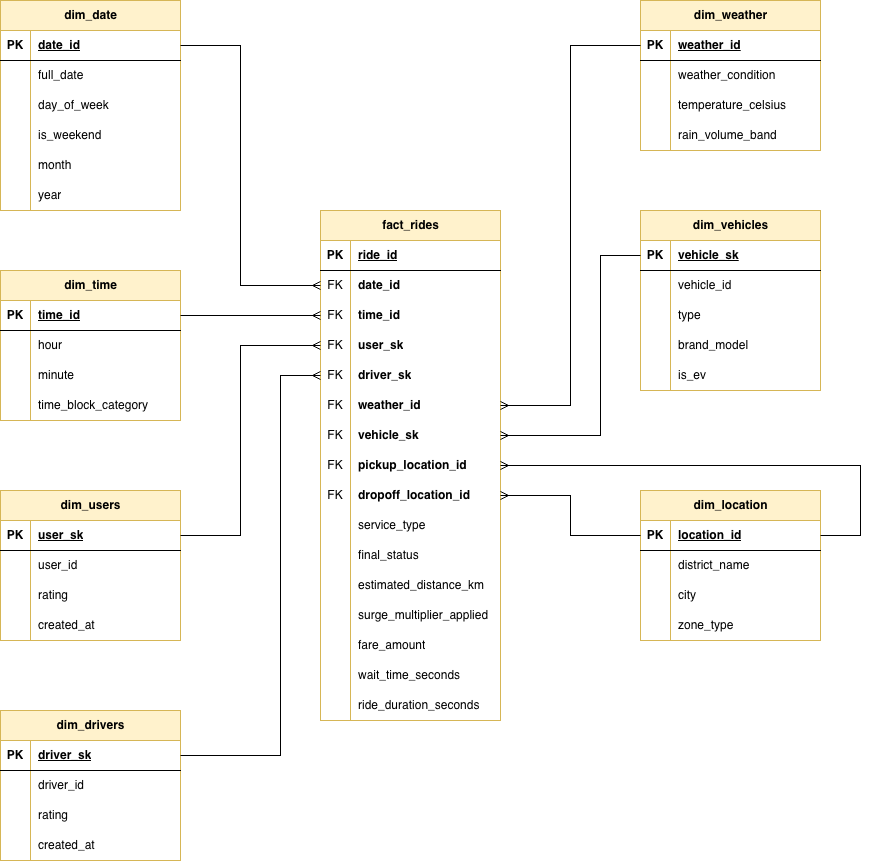

# DWH DESIGN — RideStream

> **Hệ thống:** RideStream — Real-time CDC & Analytics Platform  
> **Loại kho dữ liệu:** Google BigQuery (OLAP / Data Warehouse)  
> **Mô hình dữ liệu:** Star Schema  
> **Phiên bản tài liệu:** 1.0  
> **Cập nhật lần cuối:** 2026-03-25

---

## Tổng quan

Data Warehouse của RideStream được xây dựng trên Google BigQuery, sử dụng mô hình Star Schema để tối ưu hóa hiệu suất truy vấn phân tích. Dữ liệu được nạp vào BigQuery thông qua kiến trúc Data Lakehouse sử dụng Google Cloud Storage (GCS) làm Staging Area:

+ Ghi vào Data Lake (GCS): Spark Structured Streaming gom các sự kiện đã xử lý thành các lô nhỏ (Micro-batch) và ghi xuống GCS dưới định dạng tối ưu (Parquet) mỗi 5-15 phút.

+ Nạp vào Data Warehouse (BigQuery): Các tác vụ Batch Job (được điều phối bởi Apache Airflow hoặc BigQuery Data Transfer) sẽ định kỳ nạp các file Parquet từ GCS vào các bảng Fact và Dimension trong BigQuery.

### Sơ đồ Star Schema

---

## Bảng Fact

## 1. Bảng `fact_rides` — Sự kiện Cuốc xe

**Ý nghĩa:** Bảng Fact trung tâm của Data Warehouse, mỗi dòng ghi lại một cuốc xe đã hoàn thành (`completed` hoặc `cancelled`). Được nạp từ bảng `rides` trong PostgreSQL OLTP sau khi cuốc xe kết thúc vòng đời.

**Granularity (Độ chi tiết):** Một dòng = Một cuốc xe.

| Tên trường              | Kiểu dữ liệu  | Ràng buộc  | Ý nghĩa                                                                                                                  |
| :---------------------- | :------------ | :--------- | :----------------------------------------------------------------------------------------------------------------------- |
| `ride_id`               | `STRING`      | **PK**     | Mã định danh duy nhất của cuốc xe. Định dạng: `RIDE-{UUID ngắn}`. Đồng nhất với `ride_id` trong PostgreSQL OLTP.        |
| `date_id`               | `INTEGER`     | **FK**     | Khóa ngoại đến `dim_date`. Xác định ngày xảy ra cuốc xe dựa trên `created_at`.                                           |
| `time_id`               | `INTEGER`     | **FK**     | Khóa ngoại đến `dim_time`. Xác định khung giờ xảy ra cuốc xe (theo giờ và phút).                                         |
| `user_sk`               | `INTEGER`     | **FK**     | Khóa ngoại đến `dim_users.user_sk` (Surrogate Key). Trỏ vào phiên bản hồ sơ hành khách **tại thời điểm cuốc xe xảy ra**, đảm bảo tính chính xác lịch sử theo SCD Type 2.  |
| `driver_sk`             | `INTEGER`     | **FK**     | Khóa ngoại đến `dim_drivers.driver_sk` (Surrogate Key). Trỏ vào phiên bản hồ sơ tài xế **tại thời điểm cuốc xe xảy ra**, đảm bảo tính chính xác lịch sử theo SCD Type 2. |
| `weather_id`            | `INTEGER`     | **FK**     | Khóa ngoại đến `dim_weather`. Điều kiện thời tiết tại thời điểm cuốc xe diễn ra (join theo timestamp).                   |
| `vehicle_sk`            | `INTEGER`     | **FK**     | Khóa ngoại đến `dim_vehicles.vehicle_sk` (Surrogate Key). Trỏ vào phiên bản thông tin phương tiện **tại thời điểm cuốc xe xảy ra**, đảm bảo tính chính xác lịch sử theo SCD Type 2.  |
| `pickup_location_id`    | `INTEGER`     | **FK**     | Khóa ngoại đến `dim_location`. Khu vực địa lý của điểm đón, được xác định qua GIS (hàm `ST_Within`).                    |
| `dropoff_location_id`   | `INTEGER`     | **FK**     | Khóa ngoại đến `dim_location`. Khu vực địa lý của điểm trả.                                                              |
| `service_type`          | `STRING`      | NOT NULL   | Loại dịch vụ sử dụng. Giá trị: `RideBike` \| `RideCar` \| `RideDelivery`.                                               |
| `final_status`          | `STRING`      | NOT NULL   | Trạng thái kết thúc của cuốc xe. Giá trị: `completed` \| `cancelled`.                                                    |
| `estimated_distance_km` | `NUMERIC`     | NULLABLE   | Quãng đường ước tính (km) được tính toán khi tạo cuốc.                                                                   |
| `surge_multiplier_applied` | `NUMERIC`  | NULLABLE   | Hệ số giá surge thực tế áp dụng (VD: `1.0` = bình thường, `1.5` = tăng 50%).                                            |
| `fare_amount`           | `NUMERIC`     | NULLABLE   | Cước phí thực tế của cuốc xe (VNĐ). `NULL` nếu cuốc bị hủy trước khi định giá.                                          |
| `wait_time_seconds`     | `INTEGER`     | NULLABLE   | Thời gian chờ tính bằng giây: từ `requested` → `accepted`. Đo lường hiệu quả điều phối.                                  |
| `ride_duration_seconds` | `INTEGER`     | NULLABLE   | Tổng thời gian thực hiện cuốc xe (giây): từ `accepted` → `completed`. `NULL` nếu cuốc bị hủy.                            |

---

## Bảng Dimension

## 2. Bảng `dim_date` — Chiều Ngày

**Ý nghĩa:** Bảng chiều thời gian theo ngày, tách biệt các thuộc tính ngày để hỗ trợ phân tích theo tuần, tháng, quý, năm và phân loại ngày làm việc/cuối tuần.

**Cách tạo:** Pre-populated (điền trước) toàn bộ ngày trong khoảng thời gian vận hành hệ thống (VD: 2025-01-01 → 2030-12-31).

| Tên trường    | Kiểu dữ liệu | Ràng buộc | Ý nghĩa                                                                      |
| :------------ | :----------- | :-------- | :--------------------------------------------------------------------------- |
| `date_id`     | `INTEGER`    | **PK**    | Khóa chính dạng số nguyên. Công thức: `YYYYMMDD` (VD: `20260313` = 13/03/2026). |
| `full_date`   | `DATE`       | NOT NULL  | Giá trị ngày đầy đủ (VD: `2026-03-13`). Dùng để join với timestamp gốc.     |
| `day_of_week` | `STRING`     | NOT NULL  | Tên ngày trong tuần. Giá trị: `Monday` \| `Tuesday` \| ... \| `Sunday`.     |
| `is_weekend`  | `BOOLEAN`    | NOT NULL  | `TRUE` nếu là Thứ 7 hoặc Chủ Nhật. Dùng để phân tích hành vi cuối tuần.    |
| `month`       | `INTEGER`    | NOT NULL  | Tháng trong năm (1–12). Dùng để nhóm và lọc theo tháng.                     |
| `year`        | `INTEGER`    | NOT NULL  | Năm dương lịch (VD: `2026`). Dùng để so sánh liên năm.                      |

---

## 3. Bảng `dim_time` — Chiều Thời gian trong ngày

**Ý nghĩa:** Bảng chiều thời gian trong ngày theo đơn vị phút, cho phép phân tích theo khung giờ cao điểm, thấp điểm. Phục vụ bài toán định giá động và phân tích lưu lượng.

**Cách tạo:** Pre-populated từ 00:00 đến 23:59 (1440 dòng).

| Tên trường          | Kiểu dữ liệu | Ràng buộc | Ý nghĩa                                                                                                      |
| :------------------ | :----------- | :-------- | :----------------------------------------------------------------------------------------------------------- |
| `time_id`           | `INTEGER`    | **PK**    | Khóa chính dạng số nguyên. Công thức: `HH * 60 + MM` (VD: `480` = 08:00, `1019` = 16:59).                   |
| `hour`              | `INTEGER`    | NOT NULL  | Giờ trong ngày (0–23).                                                                                        |
| `minute`            | `INTEGER`    | NOT NULL  | Phút trong giờ (0–59).                                                                                        |
| `time_block_category` | `STRING`   | NOT NULL  | Phân loại khung giờ đặc thù. Giá trị: `Morning_Rush` \| `Evening_Rush` \| `Weekend_Peak` \| `Off_Peak`. |

**Định nghĩa phân loại `time_block_category`:**

| Giá trị         | Điều kiện                                          |
| :-------------- | :------------------------------------------------- |
| `Morning_Rush`  | 07:00 – 09:00 (Thứ 2 → Thứ 6)                    |
| `Evening_Rush`  | 16:30 – 19:00 (Thứ 2 → Thứ 6)                    |
| `Weekend_Peak`  | 18:00 – 23:00 (Thứ 7 và Chủ Nhật)                |
| `Off_Peak`      | Tất cả các khung giờ còn lại                       |

---

## 4. Bảng `dim_users` — Chiều Hành khách

**Ý nghĩa:** Bảng chiều lưu thông tin mô tả hành khách trong Data Warehouse, phục vụ phân tích hành vi người dùng và phân khúc khách hàng. Được đồng bộ định kỳ từ bảng `users` trong PostgreSQL OLTP. Áp dụng **SCD Type 2** — mỗi lần thông tin hành khách thay đổi (VD: rating được cập nhật), hệ thống sẽ **thêm một dòng mới** thay vì ghi đè, đảm bảo mọi cuốc xe trong `fact_rides` luôn liên kết đúng vào phiên bản hồ sơ **tại thời điểm xảy ra**.

| Tên trường        | Kiểu dữ liệu | Ràng buộc        | Ý nghĩa                                                                                                                                  |
| :---------------- | :----------- | :--------------- | :--------------------------------------------------------------------------------------------------------------------------------------- |
| `user_sk`         | `INTEGER`    | **PK**, AUTO INC | **Surrogate Key** — Khóa thay thế tự tăng, là khóa chính kỹ thuật của bảng. Được sinh bởi DWH, không có ý nghĩa nghiệp vụ.              |
| `user_id`         | `STRING`     | NOT NULL         | **Natural Key** — Mã định danh nghiệp vụ gốc từ OLTP. Định dạng: `USR-{số}`. Dùng để tra cứu hành khách và đồng bộ dữ liệu.             |
| `rating`          | `NUMERIC`    | NULLABLE         | Điểm đánh giá trung bình của hành khách (thang 5 sao) **tại thời điểm phiên bản này có hiệu lực**.                                      |
| `created_at`      | `TIMESTAMP`  | NOT NULL         | Ngày hành khách đăng ký tài khoản gốc. Dùng để phân tích cohort người dùng mới. Không thay đổi qua các phiên bản SCD.                   |
| `effective_date`  | `TIMESTAMP`  | NOT NULL         | **[SCD Type 2]** Thời điểm phiên bản này bắt đầu có hiệu lực (ngày dòng được INSERT vào DWH).                                           |
| `expiration_date` | `TIMESTAMP`  | NULLABLE         | **[SCD Type 2]** Thời điểm phiên bản này hết hiệu lực. `NULL` nếu đây là phiên bản **hiện tại** (`is_current = TRUE`).                  |
| `is_current`      | `BOOLEAN`    | NOT NULL         | **[SCD Type 2]** Cờ đánh dấu phiên bản hiện hành. `TRUE` = hồ sơ đang có hiệu lực; `FALSE` = hồ sơ lịch sử, đã bị thay thế bởi phiên bản mới hơn. |

---

## 5. Bảng `dim_drivers` — Chiều Tài xế

**Ý nghĩa:** Bảng chiều lưu thông tin mô tả tài xế trong Data Warehouse, phục vụ phân tích hiệu suất tài xế theo khu vực, khung giờ và điều kiện thời tiết. Được đồng bộ định kỳ từ bảng `drivers` trong PostgreSQL OLTP. Áp dụng **SCD Type 2** — rating của tài xế thay đổi sau mỗi lần đánh giá; mỗi sự thay đổi tạo ra một phiên bản lịch sử mới, cho phép phân tích chính xác hiệu suất tài xế theo từng giai đoạn.

| Tên trường        | Kiểu dữ liệu | Ràng buộc        | Ý nghĩa                                                                                                                                  |
| :---------------- | :----------- | :--------------- | :--------------------------------------------------------------------------------------------------------------------------------------- |
| `driver_sk`       | `INTEGER`    | **PK**, AUTO INC | **Surrogate Key** — Khóa thay thế tự tăng, là khóa chính kỹ thuật của bảng. Được sinh bởi DWH, không có ý nghĩa nghiệp vụ.              |
| `driver_id`       | `STRING`     | NOT NULL         | **Natural Key** — Mã định danh nghiệp vụ gốc từ OLTP. Định dạng: `DRV-{số}`. Dùng để tra cứu tài xế và đồng bộ dữ liệu.                |
| `rating`          | `NUMERIC`    | NULLABLE         | Điểm đánh giá trung bình của tài xế (thang 5 sao) **tại thời điểm phiên bản này có hiệu lực**.                                          |
| `created_at`      | `TIMESTAMP`  | NOT NULL         | Ngày tài xế đăng ký vào nền tảng. Dùng để tính tenure (thâm niên). Không thay đổi qua các phiên bản SCD.                                |
| `effective_date`  | `TIMESTAMP`  | NOT NULL         | **[SCD Type 2]** Thời điểm phiên bản này bắt đầu có hiệu lực (ngày dòng được INSERT vào DWH).                                           |
| `expiration_date` | `TIMESTAMP`  | NULLABLE         | **[SCD Type 2]** Thời điểm phiên bản này hết hiệu lực. `NULL` nếu đây là phiên bản **hiện tại** (`is_current = TRUE`).                  |
| `is_current`      | `BOOLEAN`    | NOT NULL         | **[SCD Type 2]** Cờ đánh dấu phiên bản hiện hành. `TRUE` = hồ sơ đang có hiệu lực; `FALSE` = hồ sơ lịch sử, đã bị thay thế bởi phiên bản mới hơn. |

---

## 6. Bảng `dim_vehicles` — Chiều Phương tiện

**Ý nghĩa:** Bảng chiều lưu thông tin mô tả phương tiện, phục vụ phân tích hiệu suất theo loại xe, hãng xe và phân loại xe điện/xăng. Được đồng bộ từ bảng `vehicles` trong PostgreSQL OLTP. Áp dụng **SCD Type 2** — tài xế có thể đổi xe (VD: chuyển từ xe máy sang xe hơi) hoặc thay xe; mỗi thay đổi tạo phiên bản lịch sử mới, đảm bảo `fact_rides` luôn ánh xạ đúng loại phương tiện thực sự được dùng trong mỗi cuốc xe.

| Tên trường        | Kiểu dữ liệu | Ràng buộc        | Ý nghĩa                                                                                                                                  |
| :---------------- | :----------- | :--------------- | :--------------------------------------------------------------------------------------------------------------------------------------- |
| `vehicle_sk`      | `INTEGER`    | **PK**, AUTO INC | **Surrogate Key** — Khóa thay thế tự tăng, là khóa chính kỹ thuật của bảng. Được sinh bởi DWH, không có ý nghĩa nghiệp vụ.              |
| `vehicle_id`      | `INTEGER`    | NOT NULL         | **Natural Key** — Mã định danh nghiệp vụ gốc từ OLTP. Dùng để tra cứu phương tiện và đồng bộ dữ liệu.                                   |
| `type`            | `STRING`     | NOT NULL         | Loại phương tiện. Giá trị: `Bike` \| `Car`. Quyết định loại dịch vụ (RideBike/RideCar).                                                 |
| `brand_model`     | `STRING`     | NOT NULL         | Hãng xe và tên dòng xe (VD: `Honda Wave Alpha 110`, `Toyota Vios`).                                                                      |
| `is_ev`           | `BOOLEAN`    | NOT NULL         | `TRUE` nếu là xe điện (Electric Vehicle). Phục vụ phân tích xu hướng chuyển dịch xanh của đội xe.                                        |
| `effective_date`  | `TIMESTAMP`  | NOT NULL         | **[SCD Type 2]** Thời điểm phiên bản này bắt đầu có hiệu lực (ngày dòng được INSERT vào DWH).                                           |
| `expiration_date` | `TIMESTAMP`  | NULLABLE         | **[SCD Type 2]** Thời điểm phiên bản này hết hiệu lực. `NULL` nếu đây là phiên bản **hiện tại** (`is_current = TRUE`).                  |
| `is_current`      | `BOOLEAN`    | NOT NULL         | **[SCD Type 2]** Cờ đánh dấu phiên bản hiện hành. `TRUE` = thông tin đang có hiệu lực; `FALSE` = thông tin lịch sử, đã bị thay thế bởi phiên bản mới hơn. |

---

## 7. Bảng `dim_location` — Chiều Địa điểm

**Ý nghĩa:** Bảng chiều địa lý xác định khu vực hành chính của điểm đón và điểm trả hành khách. Được tạo bằng cách ánh xạ tọa độ GPS (lat/lon) từ bảng `rides` sang quận/huyện thông qua phân tích không gian GIS (`ST_Within` với dữ liệu GeoJSON ranh giới TP.HCM).

| Tên trường      | Kiểu dữ liệu | Ràng buộc | Ý nghĩa                                                                                                |
| :-------------- | :----------- | :-------- | :----------------------------------------------------------------------------------------------------- |
| `location_id`   | `INTEGER`    | **PK**    | Mã định danh duy nhất tự tăng của khu vực địa lý.                                                      |
| `district_name` | `STRING`     | NOT NULL  | Tên quận/huyện (VD: `Quận 1`, `Quận 3`, `Thành phố Thủ Đức`). Kết quả sau khi GIS lookup.             |
| `city`          | `STRING`     | NOT NULL  | Tên thành phố (VD: `Ho Chi Minh City`). Dùng để mở rộng hệ thống sang đa thành phố trong tương lai.   |
| `zone_type`     | `STRING`     | NOT NULL  | Phân loại vùng địa lý. Giá trị: `Central` (Trung tâm) \| `Suburban` (Ngoại ô) \| `Industrial` (Khu CN). |

---

## 8. Bảng `dim_weather` — Chiều Thời tiết

**Ý nghĩa:** Bảng chiều lưu trữ các điều kiện thời tiết đã được rời rạc hóa (discretized) và phân loại, phục vụ phân tích tác động thời tiết lên nhu cầu gọi xe, định giá động và doanh thu. Được nạp từ dữ liệu OpenWeatherMap API (qua Airflow → Kafka → Spark).

| Tên trường            | Kiểu dữ liệu | Ràng buộc | Ý nghĩa                                                                                                          |
| :-------------------- | :----------- | :-------- | :--------------------------------------------------------------------------------------------------------------- |
| `weather_id`          | `INTEGER`    | **PK**    | Mã định danh tự tăng của bản ghi thời tiết.                                                                       |
| `weather_condition`   | `STRING`     | NOT NULL  | Trạng thái thời tiết chính. Giá trị: `Clear` \| `Clouds` \| `Rain` \| `Thunderstorm` \| `Drizzle` \| `Haze`.    |
| `temperature_celsius` | `NUMERIC`    | NOT NULL  | Nhiệt độ thực đo (°C) tại thời điểm thu thập.                                                                    |
| `rain_volume_band`    | `STRING`     | NOT NULL  | Phân loại lượng mưa thành các dải để dễ phân tích. Giá trị: `None` \| `Light (<5mm)` \| `Moderate (5–20mm)` \| `Heavy (>20mm)`. |

**Lưu ý về `rain_volume_band`:**
- `None`: `rain.1h` = 0 hoặc không có dữ liệu mưa.
- `Light`: 0 < `rain.1h` ≤ 5mm.
- `Moderate`: 5 < `rain.1h` ≤ 20mm.
- `Heavy`: `rain.1h` > 20mm → Ngưỡng kích hoạt Surge Pricing Alert.

---

## Quan hệ giữa các bảng (Relationships)

| Bảng Fact    | FK trong Fact   | PK trong Dimension    | Bảng Dimension | Ghi chú                                                             |
| :----------- | :-------------- | :-------------------- | :------------- | :------------------------------------------------------------------ |
| `fact_rides` | `date_id`       | `date_id`             | `dim_date`     | Ngày xảy ra cuốc xe                                                 |
| `fact_rides` | `time_id`       | `time_id`             | `dim_time`     | Khung giờ xảy ra cuốc xe                                            |
| `fact_rides` | `user_sk`       | `user_sk` (**SK**)    | `dim_users`    | Trỏ vào phiên bản SCD2 của hành khách tại thời điểm cuốc xe         |
| `fact_rides` | `driver_sk`     | `driver_sk` (**SK**)  | `dim_drivers`  | Trỏ vào phiên bản SCD2 của tài xế tại thời điểm cuốc xe            |
| `fact_rides` | `weather_id`    | `weather_id`          | `dim_weather`  | Điều kiện thời tiết tại thời điểm cuốc xe                           |
| `fact_rides` | `vehicle_sk`    | `vehicle_sk` (**SK**) | `dim_vehicles` | Trỏ vào phiên bản SCD2 của phương tiện tại thời điểm cuốc xe        |
| `fact_rides` | `pickup_location_id`  | `location_id`   | `dim_location` | Khu vực địa lý điểm đón                                             |
| `fact_rides` | `dropoff_location_id` | `location_id`   | `dim_location` | Khu vực địa lý điểm trả                                             |

---

## Chiến lược ETL / Nạp dữ liệu

### Luồng nạp chính

```
Kafka (Topic: cuốc xe & thời tiết)
  │
  ▼ Spark Structured Streaming (Xử lý Real-time & Micro-batch)
  │  - Lookup GIS: (lat, lon) → location_id
  │  - Join thời tiết: timestamp ↔ weather snapshot
  │  - Tính wait_time_seconds, ride_duration_seconds
  │  - Gán date_id, time_id
  │
  ▼ Ghi file Parquet (mỗi 5-15 phút)
Google Cloud Storage (GCS - Data Lake)
  │
  ▼ Apache Airflow / BigQuery Data Transfer (Chạy Batch định kỳ)
Google BigQuery (fact_rides + dim_*)
```

### Bảng Dimension — Chiến lược cập nhật (SCD)

| Bảng Dimension | Loại SCD        | Chiến lược                                                                                                                                              |
| :------------- | :-------------- | :------------------------------------------------------------------------------------------------------------------------------------------------------ |
| `dim_date`     | Tĩnh (SCD0)     | Pre-populated. Không thay đổi.                                                                                                                          |
| `dim_time`     | Tĩnh (SCD0)     | Pre-populated (1440 dòng). Không thay đổi.                                                                                                              |
| `dim_users`    | **SCD Type 2**  | **Lưu lịch sử.** Khi `rating` thay đổi: UPDATE `is_current = FALSE`, `expiration_date = NOW()` cho dòng cũ → INSERT dòng mới với `user_sk` mới, `effective_date = NOW()`, `is_current = TRUE`. |
| `dim_drivers`  | **SCD Type 2**  | **Lưu lịch sử.** Khi `rating` thay đổi: UPDATE `is_current = FALSE`, `expiration_date = NOW()` cho dòng cũ → INSERT dòng mới với `driver_sk` mới, `effective_date = NOW()`, `is_current = TRUE`. |
| `dim_vehicles` | **SCD Type 2**  | **Lưu lịch sử.** Khi tài xế đổi xe hoặc thông tin xe thay đổi: UPDATE `is_current = FALSE`, `expiration_date = NOW()` cho dòng cũ → INSERT dòng mới với `vehicle_sk` mới, `effective_date = NOW()`, `is_current = TRUE`. |
| `dim_location` | Tĩnh (SCD0)     | Pre-populated từ GeoJSON TP.HCM. Chỉ thêm mới khi mở rộng vùng.                                                                                       |
| `dim_weather`  | Append-only     | Thêm mới mỗi lần ghi — giữ nguyên lịch sử thời tiết theo timestamp.                                                                                    |

---


## Ghi chú

- **Không lưu PII (Personally Identifiable Information)** trực tiếp trong DWH: Tên, số điện thoại, biển số xe được giữ ở OLTP (PostgreSQL). DWH chỉ lưu mã định danh (ID) để join.
- **`dim_users` và `dim_drivers`** trong DWH chỉ chứa các thuộc tính phân tích (`rating`, `created_at`), không chứa thông tin cá nhân nhạy cảm.
- **Surrogate Keys & SCD Type 2 (Bắt buộc):** Các bảng chiều có khả năng biến động (`dim_users`, `dim_drivers`, `dim_vehicles`) sử dụng Khóa thay thế (Surrogate Key - `_sk`) do DWH tự sinh làm Khóa chính, thay vì dùng Khóa tự nhiên (Natural Key - `_id`) từ OLTP. Khi thực hiện truy vấn JOIN từ bảng `fact_rides`, **bắt buộc phải sử dụng Surrogate Key** để đảm bảo dữ liệu quá khứ không bị sai lệch bởi các cập nhật hiện tại.
